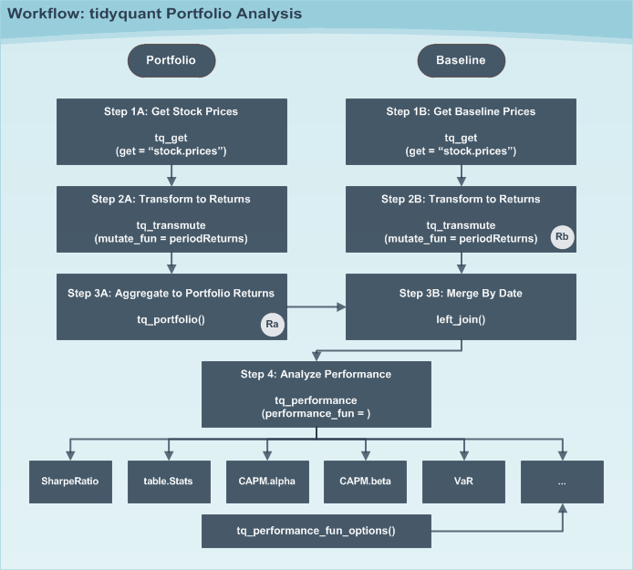
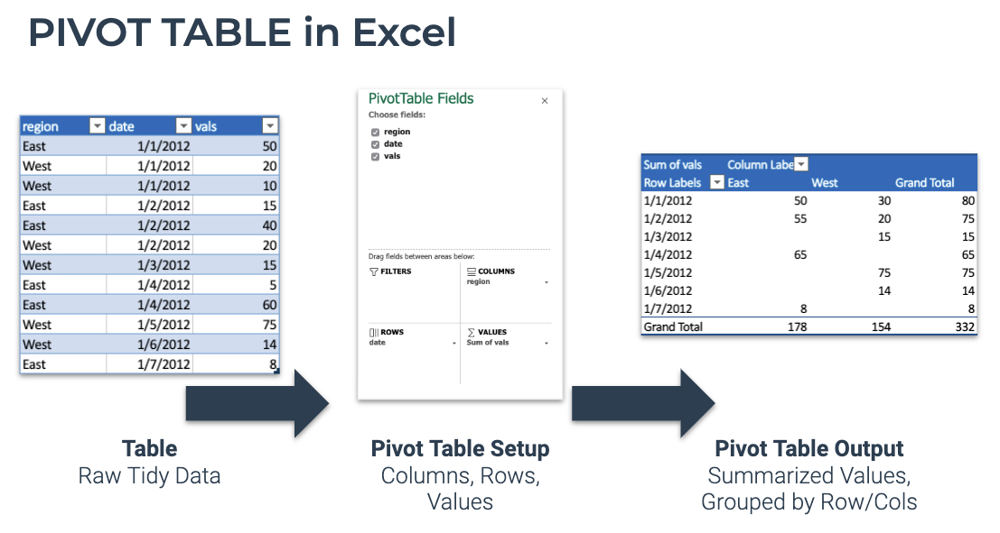

---
title: "Tidyquant Library"
author: "Ali Tahsili"
date: "13/11/2021"
output:
  revealjs::revealjs_presentation:
    center: true
    transition: slide
    css: styles.css
    self_contained: true
    reveal_options:
      slideNumber: true
---

```{r setup, include=FALSE}
library(tidyquant)
library(tidyverse)
library(knitr)
knitr::opts_chunk$set(echo = TRUE, warning = FALSE, message = FALSE)
```

# Discription

## Features of Tidyquant

- A few core functions with a lot of power

- Integrates the quantitative analysis functionality of zoo, xts, quantmod, TTR, and PerformanceAnalytics

- Designed for modeling and scaling analyses using the tidyverse tools in R for Data Science

- Implements ggplot2 functionality for beautiful and meaningful financial visualizations

## Core Functions

- <strong>tq_get()</strong>: Getting Financial Data from the web 

- <strong>tq_transmute()</strong> and <strong>tq_mutate()</strong>: Manipulating Financial Data
  
- <strong>tq_performance()</strong> and <strong>tq_portfolio()</strong>: Performance Analysis and Portfolio Analysis

# tq_get()

##

The <strong>tq_get()</strong> function is used to collect data by changing the get argument. The data sources:

1- Yahoo Finance - Daily stock data

2- FRED - Economic data

3- Quandl - Economic, Energy, & Financial Data API

4- Tiingo - Financial API with sub-daily stock data and crypto-currency

5- Alpha Vantage - Financial API with sub-daily, ForEx, and crypto-currency data

6- Bloomberg - Financial API. Paid account is required.

```{r}
tq_get_options()
```

##

We can use <strong>tq_get()</strong> in the following form:

__tq_get(x, get = "stock.prices", from = "date", to = "date", ...)__

## Collecting Data from Yahoo Finance

```{r}
(Stocks_Price_Data <- tq_get(c("GOOG", "AMZN"),
      get  = "stock.prices",
      from = "2017-01-01",
      to   = "2018-01-01"))
```

##

```{r fig.align = "center", fig.height = 5,  fig.width = 7}
Stocks_Price_Data %>% 
  ggplot() + 
  aes(date, log(adjusted), color = symbol) + 
  geom_line()
```

## Candlestick Chart

```{r fig.align = "center", fig.height = 3.5,  fig.width = 7}
# Get AAPL and AMZN Stock Prices
AAPL <- tq_get("AAPL", get = "stock.prices", from = "2015-09-01", to = "2016-12-31")

AAPL %>%
    ggplot(aes(x = date, y = close)) +
    geom_candlestick(aes(open = open, high = high, low = low, close = close)) +
    labs(title = "AAPL Candlestick Chart", y = "Closing Price", x = "") +
    theme_tq()
```


## Collecting Data from FRED

A wealth of economic data can be extracted from the Federal Reserve Economic Data (FRED) database. The FRED contains over 10K data sets that are free to use. 
The WTI Crude Oil Prices are shown below.

```{r}
tq_get("DCOILWTICO", get = "economic.data")
```

```{r echo=F}
quandl_api_key("zhiuacphNt-LsLWq5_C9")
```

## Collecting Data from quandl

The following uses get = "quandl" and the “WIKI” database to download daily stock prices for FB and AAPL in 2016. The output is a tidy data frame.
```{r}
# quandl_api_key("<your-api-key>")
c("WIKI/FB", "WIKI/AAPL") %>%
    tq_get(get  = "quandl",
           from = "2016-01-01",
           to   = "2016-12-31")
```

## Indexes and Exchanges

There are specifically two functions for indexes and exchanges:

<strong>tq_index()</strong> consists of 5 indexes.
```{r}
tq_index_options()
```

<strong>tq_exchange()</strong> consists of 3 exchanges.

```{r}
tq_exchange_options()
```

## Example for index

```{r}
tq_index("SP500")
```

## Example for exchange

```{r}
tq_exchange("NASDAQ")
```

# tq_transmute() and tq_mutate()

## 

Integration for many financial functions from xts, zoo, quantmod,TTR and PerformanceAnalytics packages.

- <strong>tq_mutate()</strong> is used to add a column to the data frame. 

- <strong>tq_transmute()</strong> is used to return a new data frame which is necessary for periodicity changes.

## Compatibility

Mutating functions enable the xts/zoo, quantmod and TTR functions to shine. 
To see tidyquant function compatibility we can use <strong>tq_transmute_fun_options()</strong> which returns a list the compatible mutate functions by each package. We’ll discuss these options by package briefly.

```{r}
tq_transmute_fun_options() %>% str()
```

## zoo Functionality

```{r}
# Get zoo functions that work with tq_transmute and tq_mutate
tq_transmute_fun_options()$zoo
```

## xts Functionality

```{r}
# Get xts functions that work with tq_transmute and tq_mutate
tq_transmute_fun_options()$xts
```

## quantmod Functionality

```{r}
# Get quantmod functions that work with tq_transmute and tq_mutate
tq_transmute_fun_options()$quantmod
```
<small>Note: we can do the same for TTR and PerformanceAnalytics functions.</small>

##

We can use <strong>tq_mutate()</strong> and <strong>tq_transmute()</strong> in the following forms:

- __tq_mutate(data, select = NULL, mutate_fun, col_rename = NULL, ohlc_fun = NULL, ...)__

- __tq_transmute(data, select = NULL, mutate_fun, col_rename = NULL, ohlc_fun = NULL, ...)__


## Two examples using quantmod and xts

We’ll go through two examples, but first let’s get some data. The __FANG__ data set will be used which consists of stock prices for FB, AMZN, NFLX, and GOOG from the beginning of 2013 to the end of 2016.

```{r}
data("FANG")

FANG
```

##
### Example 1: (quantmod::periodReturn() function)
Our goal is to convert prices to returns

```{r}
FANG_annual_returns <- FANG %>%
    group_by(symbol) %>%
    tq_transmute(select     = adjusted, 
                 mutate_fun = periodReturn, 
                 period     = "yearly", 
                 type       = "arithmetic")
FANG_annual_returns %>% head(5)
```

## Countinue

```{r}
FANG_yearly_returns <- FANG_annual_returns %>%
    ggplot(aes(x = date, y = yearly.returns, fill = symbol)) +
    geom_col() +
    geom_hline(yintercept = 0, color = palette_light()[[1]]) +
    scale_y_continuous(labels = scales::percent) +
    labs(title = "FANG: Annual Returns",
         subtitle = "Get annual returns quickly with tq_transmute!",
         y = "Annual Returns", x = "") + 
    facet_wrap(~ symbol, ncol = 2, scales = "free_y") +
    theme_tq() + 
    scale_fill_tq()
```

## 

```{r, fig.align='center', fig.height = 5,  fig.width = 7}
FANG_yearly_returns
```

##
### Example 2 (xts::to.period function)
Our goal is to change the periodicity from daily to monthly

```{r}
FANG %>%
    group_by(symbol) %>%
    tq_transmute(select     = open:volume, 
                 mutate_fun = to.period, 
                 period     = "months") %>% head(5)
```

##

A common usage case is to reduce the number of points to smooth time series plots. Let’s check out difference between daily and monthly plots.

### Without Periodicity Aggregation

```{r}
FANG_daily <- FANG %>%
    group_by(symbol)

FANG.plot.daily <- FANG_daily %>%
    ggplot(aes(x = date, y = adjusted, color = symbol)) +
    geom_line(size = 1) +
    labs(title = "Daily Stock Prices",
         x = "", y = "Adjusted Prices", color = "") +
    facet_wrap(~ symbol, ncol = 2, scales = "free_y") +
    scale_y_continuous(labels = scales::dollar) +
    theme_tq() + 
    scale_color_tq()
```


##

```{r, fig.align='center', fig.height = 5,  fig.width = 7}
FANG.plot.daily 
```


## 

### With Monthly Periodicity Aggregation

```{r}
FANG_monthly <- FANG %>%
    group_by(symbol) %>%
    tq_transmute(select     = adjusted, 
                 mutate_fun = to.period, 
                 period     = "months")

FANG.plot.daily <- FANG_monthly %>%
    ggplot(aes(x = date, y = adjusted, color = symbol)) +
    geom_line(size = 1) +
    labs(title = "Monthly Stock Prices",
         x = "", y = "Adjusted Prices", color = "") +
    facet_wrap(~ symbol, ncol = 2, scales = "free_y") +
    scale_y_continuous(labels = scales::dollar) +
    theme_tq() + 
    scale_color_tq()
```


##

```{r, fig.align='center', fig.height = 5,  fig.width = 7}
FANG.plot.daily 
```

# tq_performance() and tq_portfolio()

##

- Asset and portfolio performance analysis has a wide range of theories and methods for analyzing risk versus reward.

- <strong>tq_performance()</strong> implements these performance analysis functions in a tidy way

- <strong>tq_performance()</strong> converts investment returns into performance metrics. 

- <strong>tq_portfolio()</strong> aggregates a group (or multiple groups) of asset returns into one or more portfolios.

<small>Important concept: Performance is based on the statistical properties of returns, and as a result this function uses stock or portfolio returns as opposed to stock prices.</small>

## 

- We can use <strong>tq_performance()</strong> in the following form:

tq_performance(data, Ra, Rb = NULL, performance_fun, ...)

<small>- Where, Ra: asset returns, Rb: baseline returns </small>

<small>- performance_fun: 129 functions to analyze stock and portfolio return performance</small>

- We can see <strong>tq_performance_fun_options()</strong> to investigate 129 functions.

- We only use two of these functions: __SharpeRatio__ and __table.CAPM__
we put each one of them for __performance_fun__ argument.

##

```{r}
# Get returns for individual stock components grouped by symbol
(Ra <- FANG %>%
    group_by(symbol) %>%
    tq_transmute(adjusted, periodReturn, 
                 period = "monthly", col_rename = "Ra"))

```

##

```{r}
# Get returns for SP500 as baseline
(Rb <- "^GSPC" %>%
    tq_get(get  = "stock.prices",
           from = "2010-01-01",
           to   = "2015-12-31") %>%
    tq_transmute(adjusted, periodReturn, 
                 period = "monthly", col_rename = "Rb"))

```

##

```{r}
# Merge stock returns with baseline
(RaRb <- left_join(Ra, Rb, by = c("date" = "date")))
```

## Sharpe Ratio

```{r}
RaRb %>%
    tq_performance(Ra = Ra, performance_fun = SharpeRatio, p = 0.95)
```

## CAPM

```{r}
RaRb %>%
    tq_performance(Ra = Ra, Rb = Rb, performance_fun = table.CAPM)
```
## 

The general workflow is shown in the diagram below. We talked about individual asset before. Now, We’ll step through the workflow of portfolio.

<center>

</center>

## Portfolios (Asset Groups)

- Portfolios are slightly more complicated because it is a groups of assets.
- We need to aggregate weighted returns.
- We use <strong>tq_portfolio()</strong>.

tq_portfolio(data, assets_col, returns_col, weights = NULL, col_rename = NULL, ...)

## 

We’ll use the weight vector, c(0.2, 0.3, 0.1, 0.4) for (FB, AMZN, NFLX, GOOG).

```{r}
wts <- c(0.2, 0.3, 0.1, 0.4) # (FB, AMZN, NFLX, GOOG)
portfolio_returns_monthly <- Ra %>%
    tq_portfolio(assets_col  = symbol, 
                 returns_col = Ra, 
                 weights     = wts, 
                 col_rename  = "Ra")
portfolio_returns_monthly %>% head()
```

# R for Excel users

##

After tidyquant version 1.0.0, these features have been added.

- Pivot Tables in R

- VLOOKUP in R

- Summarizing “IFS” Functions

- 100 + New Excel Functions

- NEW API Integrations 

## Excel Pivot Tables

For those that may have never used the Excel Pivot Table before, the process goes something like this.

- Start with a raw table in “long” format where each row is a unique observation
- Use the Excel Pivot Table dialog to position fields into Columns, Rows, and Summarized Values
- The Pivot Table is returned with the data summarized into columns and rows

<center>

</center>

## R Pivot Table

In R with <strong>pivot_table()</strong>, we can do the same as Excel’s Pivot Table.

```{r}
FANG %>% head()
```

##

- We can summarize this information with a Pivot Table using pivot_table(.rows, .columns, .values).

- First, we take a look to see if there are any missing (NA) values. 

- The only trick is to use a ~ in front of any calculations.

```{r}
FANG %>%
    pivot_table(
        .columns = symbol,
        .values  = ~ SUM(is.na(adjusted))
    ) %>%
    kable()
```

##

- Next, we do some financial summarizations. 

- First, take a look at percentage returns by year and quarter. 

- This is easy to do by using stacked functions with the c() operator on .columns and .rows.

##

```{r}
FANG %>%
    pivot_table(
        .rows    = c(symbol, ~ QUARTER(date)),
        .columns = ~ YEAR(date),
        .values  = ~ (LAST(adjusted) - FIRST(adjusted)) / FIRST(adjusted)
    ) %>%
    kable(format = "markdown")
```

